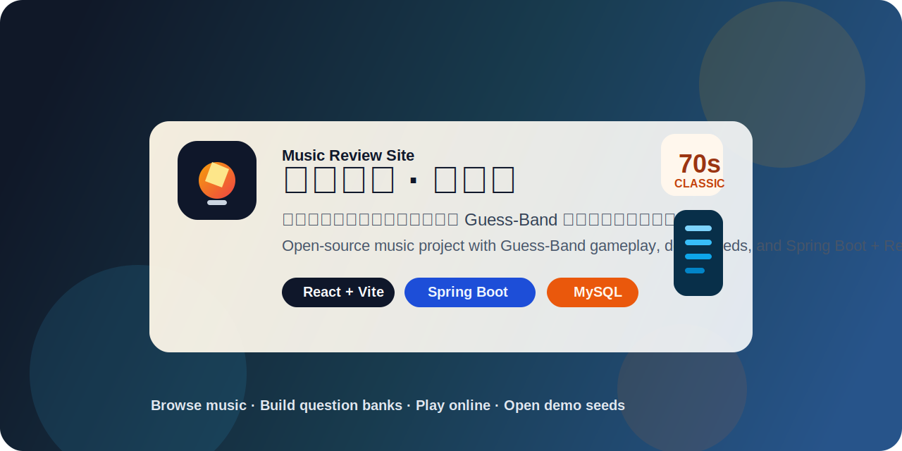

<p align="center">
  
</p>

# Music Review Site（乐评网站）

一个以音乐发现和“猜乐队”玩法为核心的全栈项目。  
A full-stack music project focused on discovery and a "Guess the Band" game.

参考站点：[`progarchives.com`](https://www.progarchives.com)  
Inspired by: [`progarchives.com`](https://www.progarchives.com)

<p align="center">
  <a href="#项目简介--overview">项目简介</a> ·
  <a href="#核心功能--features">核心功能</a> ·
  <a href="#快速开始--quick-start">快速开始</a> ·
  <a href="#开源边界--open-source-scope">开源边界</a>
</p>

## 项目简介 / Overview

这个项目最初是一个音乐站点实验，后来逐渐演变成以“猜乐队”为核心体验的站点：  
用户可以浏览乐队、专辑、曲目，注册登录，收藏和评论内容，也可以创建自己的题库或进入联机房间进行猜乐队对战。  

This project started as an experimental music website and gradually evolved into a game-centered music platform.  
Users can browse artists, albums, and tracks, register accounts, create question banks, and play the Guess-Band mode locally or online

## 核心功能 / Features

- 猜乐队主站：默认题库、公开题库、自选题库、联机模式  
  Guess-Band gameplay: default banks, public banks, custom banks, and online rooms
- 音乐目录浏览：艺术家、专辑、曲目、流派  
  Music catalog browsing: artists, albums, tracks, and genres
- 用户系统：注册、登录、JWT 鉴权  
  User system: registration, login, JWT-based auth
- 社区能力：收藏与评论  
  Community features: favorites and reviews
- 游客题库：未登录状态下可使用本地 `localStorage` 保存题库  
  Guest banks: local question banks stored in `localStorage`

## 技术栈 / Tech Stack

| 层级 | 技术 |
|------|------|
| 前端 Frontend | React + Vite + Ant Design |
| 后端 Backend | Spring Boot |
| 数据库 Database | MySQL |
| 缓存 Cache | Redis |
| 认证 Auth | JWT |

## 仓库结构 / Repository Structure

```text
music-review-site/
├── backend/          # Spring Boot 后端
├── frontend/         # React 前端
├── database/         # 数据库脚本与公开种子
└── README.md
```

## 开源边界 / Open-Source Scope

这个仓库已经按公开仓库的标准做过清理：  
数据库账号、JWT secret、私有部署脚本、真实用户数据都不在仓库里。  

This repository has been cleaned up for public use:  
database credentials, JWT secrets, private deployment scripts, and real user data are not included.

公开仓库当前可以复现的内容：  
What the public repo can reproduce:

- 音乐目录浏览
- 猜乐队默认题库
- 演示公开题库
- 登录后自行创建题库
- 联机房间相关代码与数据库结构

公开仓库当前不会复现的内容：  
What the public repo does not reproduce:

- 私有题库
- 游客本地题库历史
- 真实用户收藏、评论、通知与行为日志
- 线上联机历史数据
- 私有部署与数据整理脚本

## 快速开始 / Quick Start

### 1. 初始化数据库 / Initialize the database

```bash
mysql -u root -p < database/init.sql
```

### 2. 导入公开音乐目录 / Import public catalog seed

```bash
mysql -u root -p music_review < database/seed_public.sql
```

`seed_public.sql` 包含以下表的数据：  
`seed_public.sql` contains data for:

- `artists`
- `genres`
- `albums`
- `album_genres`
- `tracks`

### 3. 导入公开猜乐队演示题库 / Import public Guess-Band demo seed

```bash
mysql -u root -p music_review < database/seed_public_guess_band.sql
```

这个种子会导入：  
This seed imports:

- 一个匿名化的 demo 用户  
  one anonymized demo user
- 3 个公开演示题库  
  3 public demo banks
- 对应的题库乐队条目  
  their related bank items

说明：  
Notes:

- 这些题库只用于公开仓库体验，不包含真实用户邮箱或私有题库。  
  These banks are for the public demo only and contain no real user emails or private banks.
- demo 用户仅用于满足外键约束，不作为真实账号使用。  
  The demo user only exists to satisfy foreign key constraints.

### 4. 启动后端 / Start the backend

参考模板：`backend/src/main/resources/application.example.properties`  
Template config: `backend/src/main/resources/application.example.properties`

Linux/macOS:

```bash
export SPRING_DATASOURCE_URL='jdbc:mysql://localhost:3306/music_review?useSSL=false&serverTimezone=UTC&allowPublicKeyRetrieval=true'
export SPRING_DATASOURCE_USERNAME='your_db_user'
export SPRING_DATASOURCE_PASSWORD='your_db_password'
export JWT_SECRET='replace_with_a_secure_random_secret_or_base64'
cd backend
./mvnw spring-boot:run
```

Windows PowerShell:

```powershell
$env:SPRING_DATASOURCE_URL='jdbc:mysql://localhost:3306/music_review?useSSL=false&serverTimezone=UTC&allowPublicKeyRetrieval=true'
$env:SPRING_DATASOURCE_USERNAME='your_db_user'
$env:SPRING_DATASOURCE_PASSWORD='your_db_password'
$env:JWT_SECRET='replace_with_a_secure_random_secret_or_base64'
cd backend
./mvnw spring-boot:run
```

说明：  
Notes:

- `JWT_SECRET` 为空时后端会直接启动失败。  
  The backend fails fast if `JWT_SECRET` is empty.
- 默认启用 Redis 登录节流；如果本地没有 Redis，可关闭 `app.auth.login.redis.enabled`。  
  Redis-based login throttling is enabled by default; disable `app.auth.login.redis.enabled` if needed.

### 5. 启动前端 / Start the frontend

```bash
cd frontend
cp .env.example .env.local
npm install
npm run dev
```

`.env.local` 示例：  
Example `.env.local`:

```dotenv
VITE_API_BASE_URL=http://localhost:8080
VITE_ALLOWED_HOSTS=localhost,127.0.0.1
```

前端默认地址：`http://localhost:5173`  
Default frontend URL: `http://localhost:5173`

## 公开种子导出 / Export Public Seeds

如果你在自己的数据库上维护了公开数据，可以重新生成公开种子。  
If you maintain your own public dataset, you can regenerate the public seeds.

先安装依赖：  
Install dependencies first:

```bash
python3 -m pip install pymysql
```

### 导出公开音乐目录 / Export public catalog

```bash
env DB_HOST=127.0.0.1 DB_PORT=3306 DB_NAME=music_review DB_USER=music_review_app DB_PASS='<db_password>' \
  python3 database/export_public_seed.py
```

### 导出公开猜乐队题库 / Export public Guess-Band banks

```bash
env DB_HOST=127.0.0.1 DB_PORT=3306 DB_NAME=music_review DB_USER=music_review_app DB_PASS='<db_password>' \
  python3 database/export_public_guess_band_seed.py
```

公开题库导出规则：  
Public bank export rules:

- 只导出 `PUBLIC` 题库  
  export `PUBLIC` banks only
- 默认跳过空题库  
  skip empty banks by default
- 自动把拥有者匿名化为 demo 用户  
  anonymize owners into demo users
- 不导出私有题库、游客题库、行为日志  
  exclude private banks, guest banks, and event logs

## 数据库表 / Database Tables

| 表名 | 说明 |
|------|------|
| `users` | 用户表 / users |
| `artists` | 艺术家表 / artists |
| `genres` | 流派表 / genres |
| `albums` | 专辑表 / albums |
| `album_genres` | 专辑-流派关联 / album-genre relation |
| `tracks` | 曲目表 / tracks |
| `favorites` | 收藏表 / favorites |
| `reviews` | 评论表 / reviews |
| `question_banks` / `question_bank_items` | 自选题库及题目 / question banks and items |
| `guess_band_online_*` | 联机猜乐队相关表 / online Guess-Band tables |

## 私有内容 / Private Content

以下内容保留为私有，不进入 GitHub：  
The following content remains private and is not included in GitHub:

- `scripts/` 下的私有部署与数据整理脚本
- `backend/uploads/` 下的本地上传资源
- 真实环境变量与生产密钥

## 开发日志 / Changelog

- `2026-01-31`：项目初始化，完成数据库设计  
  Project initialized and database design completed
- `2026-04-14`：补充开源版公开题库种子与导出脚本  
  Added public demo bank seeds and export scripts for open-source release
